# Agent Orchestra · 迭代任务清单

> 一个**学习导向**的多 Agent 编排引擎。严格对标 **Claude Code 的真实编排设计**,用 Python 重写。
> 目标不是"又一个框架",而是 **一步步逼近 Claude Code 的多 Agent 编排效果 —— 且每个迭代都能立刻上手体验。**
>
> 用法:从 M1 往下,一个迭代一个 commit。每个迭代有【目标】【🎮 你能体验到】【对标】【要写】【做完的标准】【学到什么】。
> 代码你来写;卡住了就拿着对应的"对标"去 Claude Code 仓库 `docs/agent-orchestration.md` 找那一节。

---

## 设计总原则(贯穿始终)

> **① 不造中央调度器。编排 = 一个「可递归、可隔离、可流式」的循环 + 一套分批规则,让协作从规则中"长出来"。**(来自 Claude Code §6)
>
> **② 每个迭代都是一个"垂直切片":写完就能开终端真聊 / 真看到行为,而不是攒到最后才能跑。**

第二条是这次重排的核心:**真实 LLM 从 M1 就接进来**,像做产品一样"先能用最小版本,再一层层进化"。MockModel 不再是驱动力,而是降级成**跑测试用的离线替身**(保留"可测试、可复现"的价值),体验始终用真模型。

### 和《Building Effective Agents》五大模式的关系

五大模式**不是**五个要单独造的功能,而是骨架搭对后**自然涌现**的位置:

| 模式 | 涌现在哪个迭代 |
|---|---|
| Prompt Chaining(串行链) | M3 主循环(结果回灌即链) |
| Routing(路由) | M5/M6(选派哪个子 Agent / 工具) |
| Parallelization(并行) | M4(读并发分批) |
| Orchestrator-Workers(编排-执行) | M6(协调器) |
| Evaluator-Optimizer(评估-优化) | M8(用现有零件组合,非新机制) |

---

## 阶段一 · 能聊天的单 Agent(每一步都能开终端体验)

### ✅ M0 · 项目骨架(已完成)
- uv 包 `agent-orchestra` 已建,Python 3.14。
- 起点:`src/orchestra/`。

---

### ⬜ M1 · 直接调真实 LLM:单轮对话

**目标**:像所有 LLM app 的"hello world"一样 —— **直接调一次真实模型 API,输入一句,拿到一句回复。** 顺手把"调模型"做成可替换的抽象,为后面所有迭代铺好地基。

**🎮 你能体验到**:`uv run orchestra chat` → 你打一句 → **真实 Claude 回你一句**。这是第一个"活的"时刻。

**对标 Claude Code**:`types/message.ts`(消息类型)+ `query/deps.ts`(依赖注入,模型可替换)。

**要写**:
- `message.py`:`Message` 类型(role:user/assistant/system + content;助手消息能携带工具调用列表)。**[已完成]**
- `model.py`:
  - `Model` 抽象基类,一个方法 `async complete(messages) -> assistant Message`。**[已完成]**
  - `MockModel`:按脚本返回 —— 留给**测试**用(无需 API key 跑 CI)。**[已完成]**
  - ⭐ **新增一个真实 provider**(M9 会扩成多家,这里先接一个能用的),实现同一个 `Model` 抽象。
- `cli.py`:加一个 `chat` 子命令 —— 读你输入 → 构造 Message → 调真实 model → 打印回复。

**做完的标准**:
- `uv run orchestra chat`,输入一句,看到真实模型的真实回复。
- `uv run pytest` 仍全绿(测试用 MockModel,不烧 API)。

**学到什么**:为什么"调模型"要做成可注入依赖(`deps.ts`)—— 真实跑用真 provider,测试用 MockModel,**同一套编排代码两边通吃**。关键考点:依赖注入、provider 无关接口设计。

---

#### 架构图

> 分两层看:**业务架构**(用户得到什么能力,不谈实现)+ **技术架构**(用什么文件/SDK/服务实现)。

**① 业务架构 —— 用户视角:发一句,得一句**

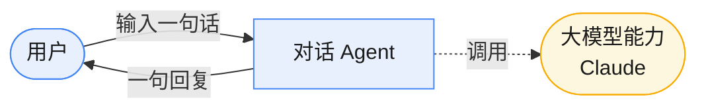

- 这一层不出现任何文件名/技术词。M1 交付的**业务能力**只有一条:**单轮问答**(发一句→收一句)。
- 注意:此时**没有记忆** —— 上一句和下一句之间没有关联(多轮记忆是 M2 的业务能力)。

**② 技术架构 —— 实现视角:依赖注入,真假实现可换**

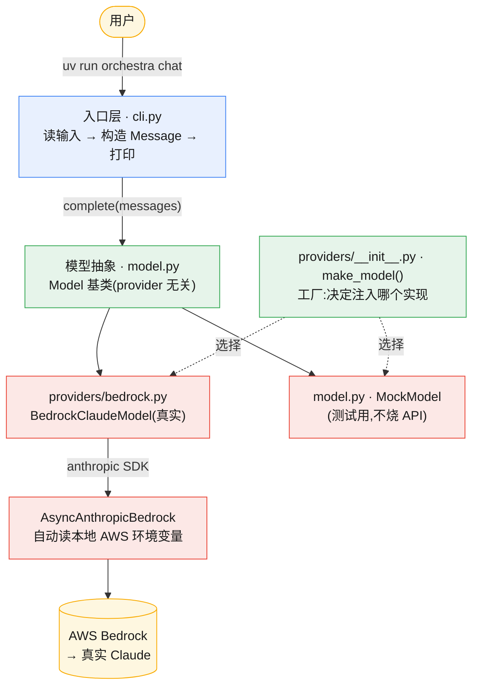

**关键点(为什么这样切)**:
- **`cli` → `Model` → provider** 是单向依赖。`cli` 不关心背后是 Bedrock 还是 Mock —— 它只调 `complete()`。
- **可替换点就一个**:`make_model()` 决定注入哪个实现。换模型 = 换一个 provider 类,编排代码零改动(这是 M9 多 provider 的回报)。
- **凭证不进代码**:`bedrock.py` 只引用环境变量名,真实 key 由 SDK 从本地环境读取。
- **数据原子**:`message.py · Message(role + content)` 贯穿全程。
- **此刻还没有的**:多轮记忆(M2)、工具与 ReAct 循环(M3/M4)。M1 的 `messages` 每次只有一条。

---

### ⬜ M2 · 多轮对话循环:上下文记忆

**目标**:把单轮变多轮 —— 让它**记得**之前说过什么。这是对话循环的最外层壳(还没有工具)。

**🎮 你能体验到**:连续对话,它记得上文 —— "我叫小明" → "我叫什么?" → "你叫小明"。

**对标 Claude Code**:`query.ts` 的会话循环(把每轮回复 append 回 messages)。

**要写**:`loop.py`(先做无工具版)
- 一个 REPL:读用户输入 → append 成 user Message → `model.complete` → 打印 → append 成 assistant Message → 回到开头。
- 上下文就是这个不断增长的 `messages` 列表。

**做完的标准**:多轮对话中,模型能引用前几轮的信息。

**学到什么**:**上下文 = 一个 Message 列表,循环每轮往里追加。** 这就是所有"记忆"的本质。

#### 架构图

> 同样分两层:**业务架构**(新增"记忆"这个能力)+ **技术架构**(新增 `loop.py` 维护历史)。

**① 业务架构 —— 用户视角:它记得上文了**

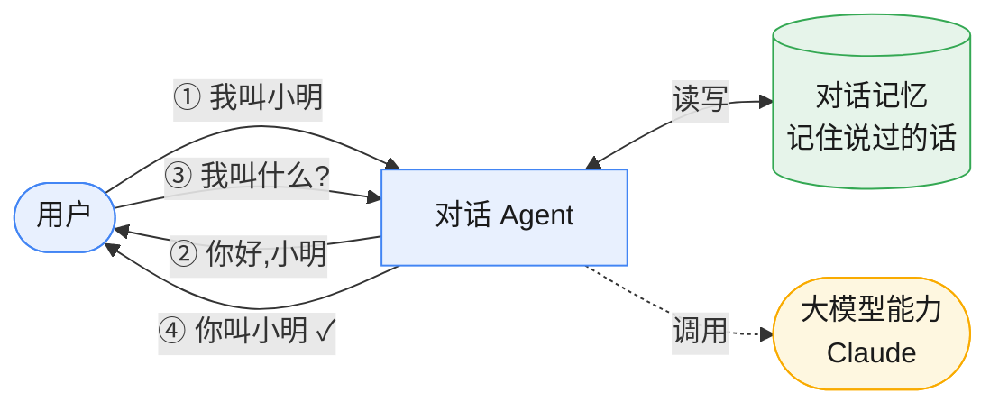

- 相比 M1,业务上**多了一个"对话记忆"** —— 第④步能答对,是因为 Agent 记得第①步。
- 这一层不谈实现,只表达:**用户能连续对话,助手记得上下文**。

**② 技术架构 —— 实现视角:新增编排层 loop.py 持有历史**

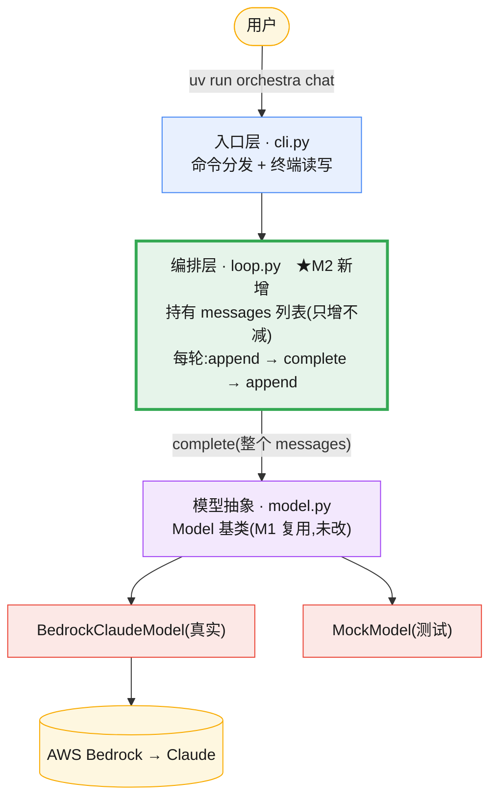

**和 M1 的唯一区别(绿色高亮处)**:
- 新增**编排层 `loop.py`**:持有一个跨轮累积的 `messages` 列表,每轮 `append 用户 → 发整个历史 → append 回复`。
- **秘密就在"发整个历史"**:第二轮把第一轮也一起发出去,模型才"看得到"上文 —— 这就是记忆的全部实现。
- **模型层/provider/凭证完全没动** —— M1 铺好的抽象直接复用,只是上面套了个"会记账"的循环。
- **还没有的**:工具、ReAct 循环(M3 把这个对话循环升级成真正的 Agent 循环)。

---

### ⬜ M3 · 第一个工具:ReAct 循环(Reason → Act → Observe)(+ maxTurns)

**目标**:让 Agent 能"动手做事"。给它一个工具,把 M2 的对话壳升级成真正的 **Agent 循环**(think→act→see)。

**🎮 你能体验到**:让它"读一下 README.md 第一行" / "现在几点" —— 它**真的调用工具去做**,拿到结果再回答你。从"会聊天"变成"会干活"。

**对标 Claude Code**:`Tool.ts`(工具抽象、`isConcurrencySafe`)+ `ToolUseContext` + `query.ts` 的 `queryLoop`(`while True`,§1)+ `maxTurns` 熔断(§2.6)。

**要写**:
- `tool.py`:`Tool` 抽象基类(`name`/`description`/`async run(input, ctx) -> str`)+ **关键字段 `is_concurrency_safe`**(M4 伏笔)+ 简单注册表 + 一两个示例工具(如 `ReadFileTool` 只读 safe=True)。
- `context.py`:`RunContext` —— 贯穿一次运行,含 `abort`(取消信号)+ `depth`(递归深度,M5 用)。
- `loop.py`:升级成 Agent 循环 ——
  ```
  while True:
      回应 = await model.complete(messages)   # 想
      if 没有工具调用: return                 # 看:没活了,结束
      串行跑工具 → 结果回灌 messages           # 做(M4 再升级成并发)
      if 轮数 > max_turns: 注入"超限"消息; return  # 熔断
  ```

**做完的标准**:
- 让它读个文件,它调 `ReadFileTool` → 看到内容 → 回答。
- 故意诱导它反复调工具,验证 `max_turns` 能刹住。

**学到什么**:这就是 **Prompt Chaining / ReAct 的本质** —— 结果回灌成下一轮输入。还有:为什么"自主"必须配 `max_turns`(防死循环烧钱)。

#### 架构图

> M3 是分水岭:从"会聊"→"会干活"。比 M1/M2 多了**工具**和**循环里的分支判断**,所以画三张:业务、技术、流程。

**① 业务架构 —— 用户视角:它会动手了**

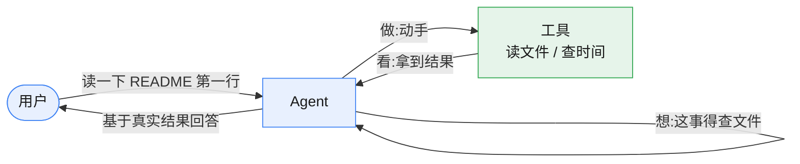

- 相比 M2(只会聊),业务上**多了"动手"能力** —— 它不再凭空回答,而是真去读文件/查时间,拿到结果再答。
- 这一层只表达:**用户能让它干活,它会自己决定"要不要用工具、用哪个"**。

**② 技术架构 —— 实现视角:新增工具系统 + 运行上下文**

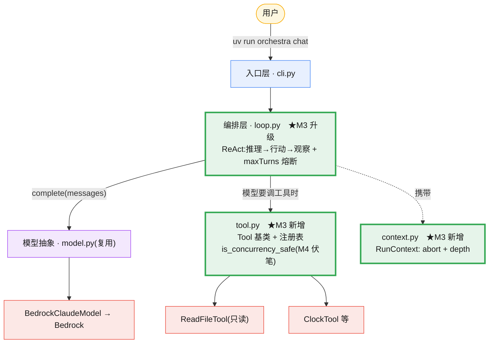

**和 M2 的区别(绿色高亮处)**:
- 新增 **`tool.py`**:工具抽象 + 注册表。每个工具自己声明 `is_concurrency_safe`(M4 并发的伏笔)。
- 新增 **`context.py`**:`RunContext` 贯穿一次运行,带取消信号 `abort` 和递归深度 `depth`(M5 子 Agent 用)。
- **`loop.py` 从"纯对话"升级成"Agent 循环"**:模型回复后要判断——要说话还是要调工具。
- 模型层/provider 仍然没动。

**③ 流程图 —— ReAct 循环(推理→行动→观察)+ maxTurns 熔断(M3 的核心)**

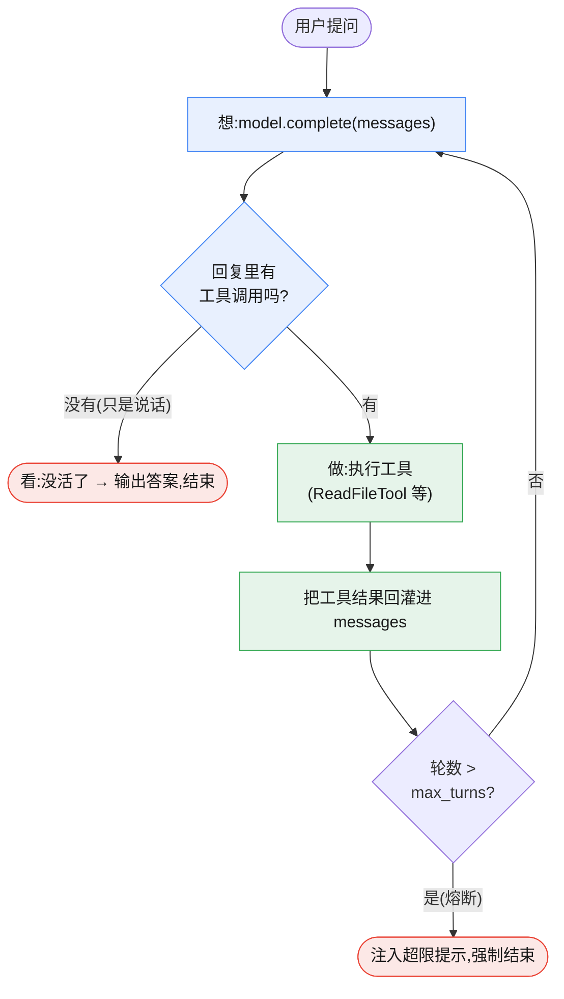

**这张图是 M3 的灵魂**:
- **ReAct 是个循环**:工具结果回灌(Observe)后**再问一次模型**(Reason),模型基于新结果决定下一步——可能再调工具(Act),也可能给最终答案。
- **结束由模型自决**:它不再要工具(只说话)= 它觉得做完了。没人规定"第几步停"——这就是 Agent 和死板 Workflow 的本质区别。
- **`max_turns` 是安全带**:能自主决策的 Agent 也可能陷死循环、停不下来烧钱,所以必须有熔断。

---

### ⬜ M4 · 多工具并发:读并发 / 写独占(并行的核心)

**目标**:模型一轮可能要调多个工具 —— 把它们**正确地并行/串行**跑掉。这是整个项目**最该吃透**的一节。

**🎮 你能体验到**:让它"同时读这 3 个文件" —— 加 `sleep` + 时间戳,你会**亲眼看到 3 个读操作同时开始**(而不是排队),写操作单独排队。

**对标 Claude Code**:`services/tools/toolOrchestration.ts`(`partitionToolCalls` + 读并发/写独占 + AsyncGenerator)。精确到行的讲解在 `docs/agent-orchestration.md` §2。

**要写**:`orchestration.py`
- `partition_tool_calls(calls)`:按 `is_concurrency_safe` 切成**连续批次**(连续只读合一批,写工具自己独占一批)。
- `run_tools(calls, ctx)`:**异步生成器** —— 只读批 `asyncio.gather` 并发(`Semaphore(10)` 限并发),写批串行 `await`,**边完成边 yield**。
- 把 M3 loop 里"串行跑工具"换成 `run_tools`。

**做完的标准**:喂 `[Read,Read,Write,Read]`,打印出分批 `[Read,Read] [Write] [Read]`,且两个 Read 同时开始。

**⚠️ 必踩的坑(故意让你踩)**:第一次大概率写出"明明并发却一个个跑"。通常是某处用了**阻塞调用**或忘了 `gather`。踩明白才真懂 async 并发。

**学到什么**:Claude Code"多 Agent 能并行"不是专门写的 —— 是"Agent 工具被标记 safe,落入只读批"的**副产品**(§2.2)。这是下一阶段的钥匙。

#### 架构图

> M4 是单 Agent 的收官,也是整个项目**最该吃透**的一节,所以画三张:业务、技术、流程。
> 关键:**没有为"并发"写专门的调度器** —— 调度只看工具自报的一个标签 `is_concurrency_safe`。

**① 业务架构 —— 用户视角:多件事一起做,该排队的排队**

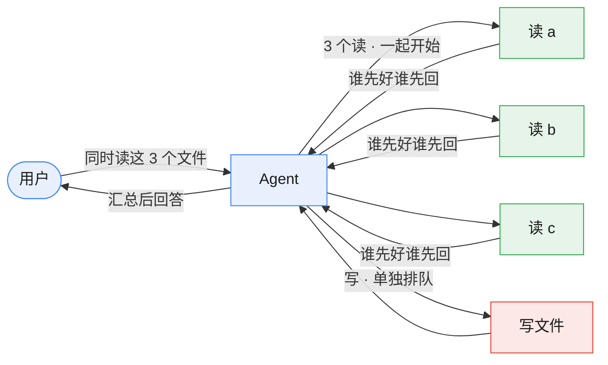

- 相比 M3(一次只跑一个工具),业务上**多了"该并行的并行"** —— 读资料像在图书馆,十个人能同时查;写文件像在白板上写字,一次只能一个人。
- 这一层只表达:**用户让它做多件事,读操作一起开跑、写操作老实排队**,体验上更快且不出乱子。

**② 技术架构 —— 实现视角:新增编排层 orchestration.py**

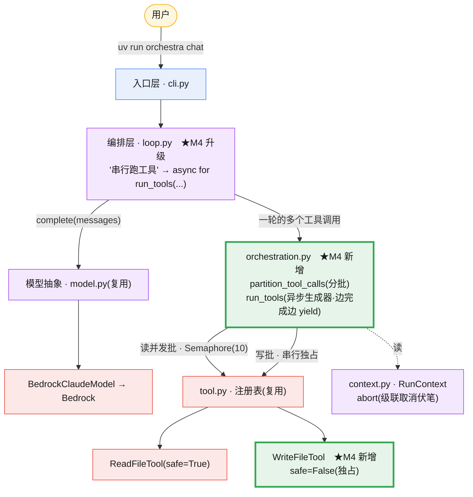

**和 M3 的区别(绿色高亮处)**:
- 新增 **`orchestration.py`**:夹在 `loop.py` 和工具注册表之间,专管"一轮里的多个工具怎么跑"。
- `loop.py` 把"逐个串行跑工具"换成一句 **`async for ... in run_tools(...)`** —— 循环骨架没动,只换了"做"这一步。
- 新增 **`WriteFileTool`**(`safe=False`):给"写独占"一个真实例子。
- 模型层 / provider 仍然没动 —— 这正是分层纪律:**新增并发能力,内核与适配层一行不改**。

**③ 流程图 —— 读并发 / 写独占(M4 的灵魂,⭐ 最核心)**

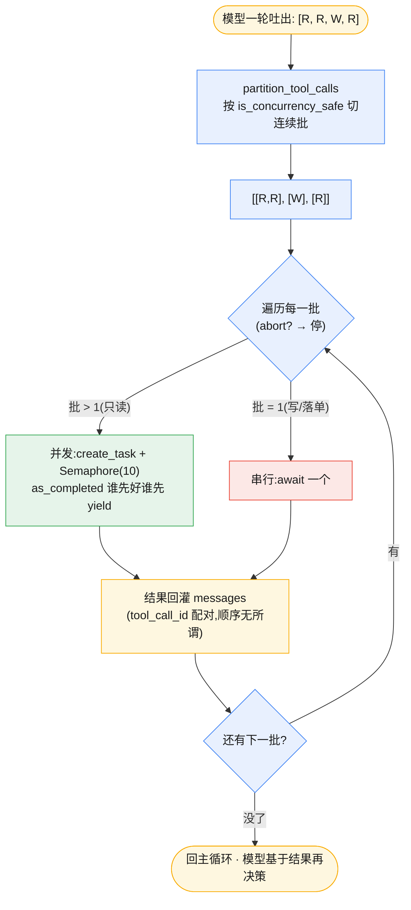

**这张图是 M4 的灵魂**:
- **分批是"连续"切的**,不是"把所有读归一批":写工具会**打断**只读批,保住"读→写→读"的先后语义。
- **只读批才真并发**:`Semaphore(10)` 压住同时在跑的数量,`as_completed` 边完成边 yield —— 这就是你会"亲眼看到 3 个读一起开始"的地方,也是**最容易踩坑**(明明 gather 却一个个跑)的地方。
- **回传顺序无所谓**:provider 用 `tool_call_id` 配对工具结果,不靠位置 —— 所以"谁先跑完先 yield"对模型完全无害。
- **`abort` 那道闸**是 M5/级联取消的伏笔:被叫停就不再开新批。

---

> 🎉 **里程碑**:M4 做完,你有了一个**完整的单 Agent** —— 能聊、能记、能干活、能并行工具、能熔断,全程真实模型驱动。后面全是"让它生出更多自己"。

---

## 阶段二 · 多 Agent 协作(每一步都能体验协作行为)

### ✅ M5 · 子 Agent(递归 + 上下文隔离)

**目标**:让 Agent 能"派一个分身去办子任务"。**核心顿悟:子 Agent = 带隔离上下文,再调一次 `run_loop`(M3)。**

**🎮 你能体验到**:给它一个需要拆分的大任务,看它**自己派出子 Agent** 去办;子 Agent 烧自己的上下文干活,只把结论交回 —— 父级"脑子"不被中间过程污染。

**对标 Claude Code**:`tools/AgentTool/runAgent.ts`(§3),结尾就是再调 `query()`。

**要写**:`subagent.py`
- `AgentTool`(本身是工具,`is_concurrency_safe=True` → 多个子 Agent 能并行!)。
- `run` 里:造隔离上下文(干净 messages + 子任务 prompt,`depth+1`)→ 调 `run_loop`(递归!)→ 只回传**最终结论**。
- **递归守卫**:`depth` 超上限就拒绝再派(防无限套娃,对标 `isInForkChild`)。

**做完的标准**:主 Agent 调 AgentTool → 子 Agent 独立跑完 mini 循环 → 交回结论;派两个子 Agent 因为 safe 能在 M4 并发批里**同时跑**。

**学到什么**:多 Agent 不需要新框架 —— **就是主循环的递归复用**。上下文隔离=保护父级预算。这里涌现 **Routing**。

#### 架构图

> M5 是阶段二的开篇,也是最关键的"顿悟"节点:**多 Agent ≠ 新框架,而是递归复用主循环**。同样画三张:业务、技术、流程。
> 关键:**AgentTool 就是一个普通工具**,被标 `safe=True` → 多个子 Agent 直接落入 M4 的只读并发批 → 并行白捡。

**① 业务架构 —— 用户视角:它能派出分身,分身只交结论**

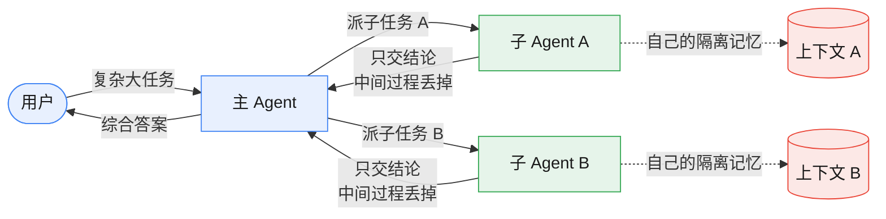

- 相比 M4(一个 Agent,工具并行),业务上**多了"分身"能力** —— 父 Agent 只管派活和汇总,子 Agent 在自己的隔离记忆里干完活,只把结论交回。
- **父级"脑子"不被中间步骤污染**:子任务的探索过程对父级透明 —— 这是上下文隔离的核心价值。
- 这里 **Routing 涌现**:模型决定派哪个子 Agent、给什么任务 —— 路由逻辑不是硬编码的,是模型自决的。

**② 技术架构 —— 实现视角:新增 subagent.py,AgentTool 递归调主循环**

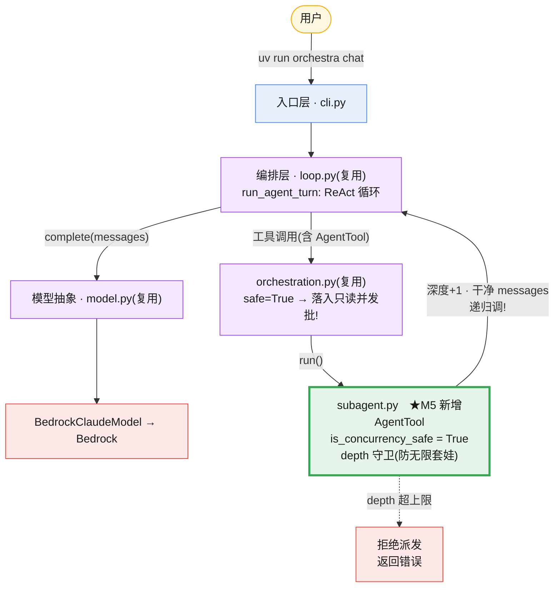

**和 M4 的区别(绿色高亮处)**:
- 新增 **`subagent.py`**:只写 `AgentTool` 一个类 —— 但它做的事极其精妙:在工具的 `run()` 里递归调回 `run_agent_turn`。
- **`AgentTool.is_concurrency_safe = True`**:这一个标签让多个子 Agent 免费并行(落入 M4 的只读并发批),不需要专门写并发代码。
- 所有已有层(**`loop.py` / `orchestration.py` / `model.py`**)一行未改 —— M5 的功能完全靠"加一个新工具"实现。
- **`depth` 守卫**:子 Agent 再派子子 Agent 会深度+1,超限拒绝 —— 对标 Claude Code 的 `isInForkChild`。

**③ 流程图 —— AgentTool.run() 内部:递归 + 上下文隔离 + 深度守卫(M5 的灵魂)**

```mermaid
flowchart TD
    CALL(["主 Agent 调 AgentTool(task=子任务)"]) --> DEPTH{"ctx.depth<br/>超上限?"}
    DEPTH -->|"是(守卫触发)"| REFUSE([拒绝:返回错误<br/>防无限套娃/烧钱])
    DEPTH -->|"否"| ISOLATE["造隔离上下文<br/>· 干净 messages(只含子任务 prompt)<br/>· new_ctx.depth = ctx.depth + 1"]
    ISOLATE --> RECURSE["递归调 run_agent_turn<br/>(就是 M3/M4 的主循环!)"]
    RECURSE --> REACT["子 Agent 自己跑 ReAct<br/>用自己的工具 / 烧自己的 tokens<br/>父级看不到这些中间步骤"]
    REACT --> END{"子 Agent 结束<br/>(自决 or max_turns 熔断)"}
    END --> EXTRACT["只取最后一条 assistant 消息<br/>= 子任务的最终结论"]
    EXTRACT --> RETURN([把结论 return 给 run_tools<br/>主循环拿到工具结果 → 继续])

    classDef call fill:#e8f0fe,stroke:#4285f4,color:#1a1a1a;
    classDef guard fill:#fce8e6,stroke:#ea4335,color:#1a1a1a;
    classDef new fill:#e6f4ea,stroke:#34a853,color:#1a1a1a;
    classDef done fill:#fef7e0,stroke:#f9ab00,color:#1a1a1a;
    class CALL,DEPTH call;
    class REFUSE guard;
    class ISOLATE,RECURSE,REACT,END new;
    class EXTRACT,RETURN done;
```

**这张图是 M5 的灵魂**:
- **递归就是全部秘密**:子 Agent 不是新概念 —— `AgentTool.run()` 的结尾就是 `await run_agent_turn(...)`,和主 Agent 跑的是完全相同的代码。
- **上下文隔离 = 干净 messages**:子 Agent 拿到的是一个只包含子任务 prompt 的空列表,看不到父级的历史 —— 中间探索步骤不会"污染"父级上下文/预算。
- **深度守卫 = 防套娃**:depth 超限时直接拒绝,对标 Claude Code `isInForkChild` —— 没有这道闸,模型一不小心就能让子 Agent 再派孙 Agent,指数级烧钱。
- **并行白捡**:`safe=True` 这一个标签,让多个 `AgentTool` 调用落入 M4 的只读并发批 —— 多 Agent 并行是 M4 分批规则的副产品,不是单独写的。

#### 🔧 实战踩坑 QA(M5 真实开发中遇到的问题 + 怎么解决的)

> 这一节记录**第一版跑起来后真实暴露的问题**。代码逻辑是对的,坑全在"给模型的规则/工具/提示"上 —— 这正是 AI 产品最该练的工程能力。深挖版见 [`06-多agent编排规格.md`](./06-多agent编排规格.md) §1.5。

**Q1:只问"对比 Python 和 Rust",怎么炸出了 11 个 Agent?**
A:`主 1 + 子 2 + 孙 8 = 11`。模型自己一层层拆:主派 2 个研究子 Agent,每个子 Agent 又各派 4 个孙 Agent 查"语言特性/生态/场景/性能"。**派几个分身是模型自决的(Routing 涌现),代码没写死。** 根因是我们的规则没拦它:① 子 Agent 手上有 `spawn_agent`(有锤子就找钉子);② 工具描述只说"何时该派"没说"何时别派";③ 子 Agent 系统提示没说"自己干完别再派"。

**Q2:怎么治"过度拆分"?**
A:吸取 Claude Code 源码的**三道防线**:
- **① 工具白名单(治本)** —— `AgentTool(allow_nesting=False)` 默认从子 Agent 工具集里**剔除 `spawn_agent`**。没有派分身的能力,从源头杜绝套娃。对标 `ALL_AGENT_DISALLOWED_TOOLS`。
- **② Prompt 纪律** —— `SUBAGENT_SYSTEM` 加"自己直接完成,不要再派生子 Agent"。对标 `forkSubagent.ts` 的 `Do NOT spawn sub-agents; execute directly`。
- **③ "何时不该派"指导** —— `spawn_agent` 描述加"简单的事自己用工具做更快"。对标 `prompt.ts` 的 `When NOT to use`。
- `max_depth` 退居"兜底护栏":仅当显式 `allow_nesting=True` 时才靠它拦无限递归。
- **结果**:同样的问题收敛到 `主 1 + 子 2 = 3` 个,depth 不超过 1。✅

**Q3:为什么跑了好几分钟?是死循环吗?(你问的那个"有 bug")**
A:**是的,真的有 bug,不是"正常的慢"。** 加 per-turn 计时诊断(`scripts/diag_m5_timing.py`)后看得一清二楚:子 Agent 被配了**用不上的 `write_file` 工具**,一个"研究优点"的纯总结任务,它居然**反复调 `write_file`**,把几千字内容当参数生成 —— **单轮模型调用飙到 60 秒,还停不下来,直奔 `max_turns=10`**(10×60s ≈ 10 分钟)。

**Q4:死循环 / 慢怎么修的?**
A:两招,都对标 Claude Code:
- **按任务收窄工具(治本死循环)** —— 加 `subagent_tools` 白名单参数,研究类子任务**只给只读工具(`read_file`/`now`),不给 `write_file`**。拿掉写工具这把锤子,子 Agent 就老实"用文本直接回答",**2 轮收工**,不再死循环。对标 `ASYNC_AGENT_ALLOWED_TOOLS`。
- **强制结论简短(治慢)** —— `SUBAGENT_SYSTEM` 加"结论控制在 300 字以内"。子 Agent 输出几千字既慢(输出 token 越多生成越慢)又污染父级上下文。对标 `Keep your report under 500 words`。

**Q5:这次踩坑最大的收获是什么?**
A:**多 Agent 的可靠性,一半靠代码约束(工具白名单、深度守卫),一半靠 prompt 纪律(系统提示、工具描述)。** "模型派几个分身、调哪些工具、说多少话",调的都是**工具集 + 提示词,不是编排逻辑**。还有一条方法论:**遇到"慢/怪",先加 per-turn 计时日志定位,别猜** —— 一加日志,"反复写文件、单轮 60 秒"立刻现形。

**新增测试覆盖**(`tests/test_m5_subagent.py`,共 8 个,全程 MockModel 不烧 API):
- 子 Agent 默认拿不到 `spawn_agent`(防线①)
- `subagent_tools` 白名单生效、`write_file` 被挡在外面(治死循环)
- `allow_nesting=True` 时深度守卫照常拦截(兜底护栏)

---

### ⬜ M6 · 协调器(Orchestrator-Workers)

**目标**:一个 leader 只"派活+综合",worker 干活且工具被收窄。

**🎮 你能体验到**:一个复杂问题 → leader 拆成 2 份派给 worker **并行研究** → 两份结论回来 → leader 综合成一个答案。worker 想越权(再派子 Agent)会被拒。

**对标 Claude Code**:`coordinator/coordinatorMode.ts`(§4.5)。

**要写**:`coordinator.py`
- coordinator 模式开关:leader 的 system prompt 改成"只派活和综合";worker 工具白名单收窄(去掉再派子 Agent 的权力,对标 `INTERNAL_WORKER_TOOLS`);worker 结果包装成"伪用户消息"回灌 leader(对标 `<task-notification>`)。

**做完的标准**:看到完整链路 leader 派活 → 2 worker 并行 → 结论回灌 → leader 综合;worker 越权被拒。

**学到什么**:教科书的 **Orchestrator-Workers** —— 编排权集中在 leader,异步结果伪装成用户消息无缝融进主循环。

---

### ⬜ M7 · Agent 间通信(mailbox + SendMessage)

**目标**:让 Agent 之间能**直接传话**(不只 leader↔worker 单向回灌)。

**🎮 你能体验到**:A 让 B 帮查个东西 → B 查完主动回传给 A —— 两个 Agent 网状协作。

**对标 Claude Code**:`utils/mailbox.ts` + `tools/SendMessageTool/`(§4.5-C)。

**要写**:
- `mailbox.py`:极简异步队列 —— `send`(有人等就唤醒,否则入队)/ `receive(filter)`(挂起等待)/ `poll`(非阻塞)。
- `send_message` 工具:Agent 给另一个 Agent 发消息。强约束:普通输出别人看不见,沟通必须调这个工具。

**做完的标准**:A `send` → B 正 `receive` 挂起 → 被唤醒收到;跑通"A 托 B 查、B 回传"的最小协作。

**学到什么**:通信机制本身极简(一个队列),复杂度在"谁能给谁发"。对比 M6:**Coordinator 星型 vs Team 网状**两种拓扑。

---

> 🎉 **里程碑**:M7 做完,你已完整复刻 Claude Code 的**两套多 Agent 协作模型**。编排内核完成。

---

### ⬜ M8 · 评估-优化循环(Evaluator-Optimizer)

**目标**:补齐五大模式最后一个。**不是新机制,是用现有零件组合。**

**🎮 你能体验到**:给个写作/方案任务,看 worker_A 出草稿 → worker_B 打分批判 → 不达标打回重做 → **几轮后收敛**到达标。

**要写**:`examples/evaluator_optimizer.py` —— worker_A 产草稿 → worker_B 批判打分 → 不达标把批判回灌重做 → 循环到达标或到上限。

**做完的标准**:看到"产出→批判→改进→再批判"收敛过程。

**学到什么**:复杂模式都是**基础零件的组合**,不需要新框架。

---

## 阶段三 · 多 provider + 落地业务

### ⬜ M9 · 多 provider 切换(架构回报)

**目标**:M1 已经接了一家真实模型;这里把它扩成**同时支持多家**(Anthropic / Bedrock / OpenAI / 国内),用户改个配置就切换。

**为什么放这里**:因为 M1 的 `Model` 抽象已经把"调模型"隔离了 —— 加一个 provider = 加一个类,**几乎零成本**。这正是对标 `deps.ts` 依赖注入的回报。(注意:这和老计划最大的不同 —— 真实模型在 M1 就有了,M9 只是"扩展",不再是"第一次接通"。)

**🎮 你能体验到**:`provider=anthropic` 改成 `provider=openai` / 国内模型,**不改任何编排逻辑**,同一段代码换个大脑跑通。

**要写**:`providers/` 子包,每家一个类都实现 M1 的 `Model` 抽象 + `make_model(provider, model_name)` 工厂。
- **关键设计**:工具调用归一化 —— 各家 function/tool calling 格式不同(Anthropic `tool_use` / OpenAI `tool_calls`),provider 层翻译成我们统一的 `ToolCall`,内核不感知。能力差异(有的国内模型不支持原生 tool calling)在 provider 层兜底。

**做完的标准**:改一个配置项换 provider 跑通,编排逻辑零改动。

**学到什么**:多 provider 的真正难点不是"调通 API",而是**把各家不同的消息/工具格式归一化到一个内部表示** —— AI 产品的核心工程能力。

> 依赖:到这步再按需 `uv add`(`anthropic` / `openai` / `boto3`),别提前装。

---

### ⬜ M10 · 调研工具 + 溯源/防幻觉
**目标**:给 Agent 真实的"手":搜索、抓网页。**每条结论必须带来源;查不到就说查不到。**
**🎮 你能体验到**:让它查一个真实问题,回答里**每条都挂着来源链接**,编不出来的就明说查不到。
**要写**:`SearchTool`、`FetchTool`;结果结构强制带 `source` 字段。
> 这是产品差异化核心,也是最值钱的 RAG/防幻觉能力点。

---

### ⬜ M11 · 业务编排:供应商挖掘 + 画像
**目标**:用 M6 协调器 + M5 子 Agent,搭真实场景(面向海外买家挖中国供应商)。
**🎮 你能体验到**:一句话需求("找做硅胶厨具的中国供应商") → 产出一张**带来源的供应商画像表**。
**要写**:Coordinator 派 挖掘 worker(找供应商)→ 背景 worker(扒资料)→ 翻译解读 worker(中→英+解读)→ 匹配 worker(打分)→ 综合成画像表。
> 这是"皮肤"。内核(M1–M8)通用,以后换"竞品分析""市场调研"只换这一层。

---

## 进度总览

```
阶段一(能聊天的单 Agent)
  M1 单轮真实对话 → M2 多轮记忆 → M3 第一个工具(ReAct) → M4 多工具并发
阶段二(多 Agent 协作)
  M5 子Agent递归 → M6 协调器 → M7 通信 → M8 评估优化
阶段三(多 provider + 落地)
  M9 多provider切换 → M10 溯源工具 → M11 供应商场景
```

**核心原则**:每个迭代写完都能 `uv run orchestra ...` 真实体验一次新能力 —— 一步步逼近 Claude Code,而不是攒到最后。

**建议节奏**:一个迭代一个 commit,message 写清"对标 Claude Code 哪个机制"。

**当前**:M0 完成,M1 的 `message.py`/`model.py` 已写好,**下一步给 M1 接真实 provider + `chat` 子命令**,就能第一次真聊。
